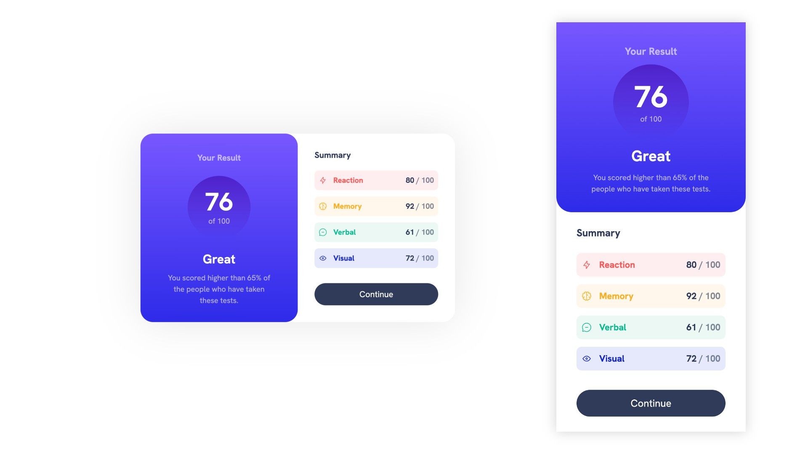

# Frontend Mentor - Results summary component solution

This is a solution to the [Results summary component challenge on Frontend Mentor](https://www.frontendmentor.io/challenges/results-summary-component-CE_K6s0maV). Frontend Mentor challenges help you improve your coding skills by building realistic projects.

### The challenge

Users should be able to:

-   View the optimal layout for the interface depending on their device's screen size
-   See hover and focus states for all interactive elements on the page

### Screenshot

### Links

-   Solution URL: [Add solution URL here](https://your-solution-url.com)
-   Live Site URL: [Add live site URL here](https://your-live-site-url.com)

## My process

Designed with a mobile first approach using HTML5/SCSS and some JavaScript.

### Built with

-   Flexbox
-   Semantic HTML5 markup
-   Syntactically Awesome Style Sheets
-   CSS custom properties
-   Mobile-first workflow

## Author

-   Frontend Mentor - [@jkvithanage](https://www.frontendmentor.io/profile/jkvithanage)
-   Twitter - [@yourusername](https://www.twitter.com/jkvithanage)
